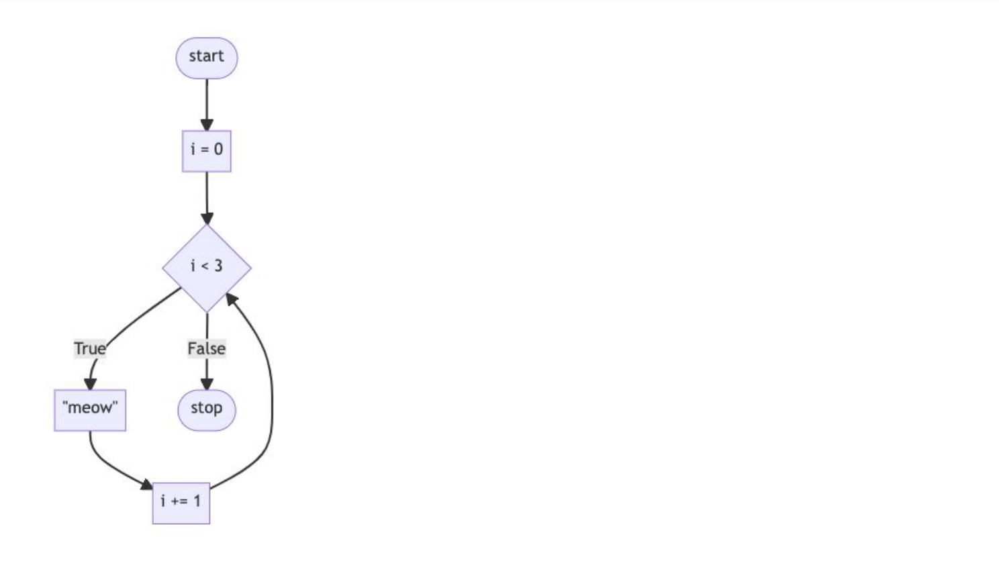
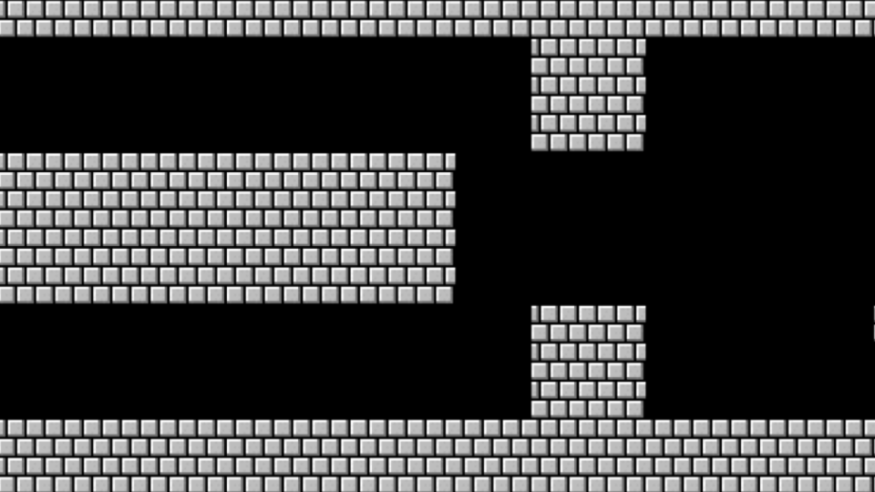

## 📝 Notes

| **Lecture** | **Topics Covered**               |         **Language**      |
|-------------|----------------------------------|---------------------------|
| `2`         | Conditionals             | Python                    |

--- 
## Lecture 2 📚

- [loops](#loops)

- [while loops](#While-Loops)

- [for loop](#for-loop)

- [Improving With User Input](#improving-with-user-input)

- [More about List](#more-about-list)

- [length](#length)

- [Dictionaries](#dictionaries)

- [Mario](#mario)

- [Summing Up](#Summing-Up)

## loops

In programming, loops are 🔁 powerful constructs that allow us to repeat a block of code multiple times, enabling us to automate repetitive tasks efficiently. ✨ Instead of writing the same code over and over 🖊️, we can use a loop to achieve the same result in a cleaner and more concise way. 🚀

For example, if we want to display the word **"meow"** 🐱 three times, we can use a loop instead of writing the print statement three times manually.

```py 
    for i range(3): # Loop runs 3 times
        print("meow")  # Prints "meow" on each iteration
```

This loop runs three times, printing "meow" 🐾 on each iteration. 

## While Loops

The `while` **loop** is used to repeatedly execute a block of code as long as a specified condition remains `True`. When the condition becomes `False`, the loop stops.

**Syntax**

To use `while` loop, follow this steps:

1. Use the keyowrds `while`

2. Define a condition that must evaluate to `True` for the loop to continue.

3. Inside the loop, perform operations and update any variables involved in the condition.

--- 


Example of while loop:

```py 
# Initialize the counter
i = 0

# Run the loop while the condition is true
while i < 3:
    print("meow")  # Print "meow" on each iteration
    i += 1         # Increment the counter
```


**Explanation**

1. **Initialization:** `i = 0`sets the starting point of the loop.

2. **Condition**: The loop runs as long as `i < 3`.

3. **Operation**: `print("meow")` is executed each time the condition is `True`

4. **Update**: `i += 1` increments the counter to avoid an infinite loop.

**Output**:
```py 
meow
meow
meow
```

This approach ensures the loop runs exactly three times, printing **"meow"** 🐾 on each iteration.


Here is the illustration of code.


## for loop

The `for` **loop** is one of the most commonly used loops in programming.  It is designed to iterate over a sequence (like a range of numbers, a list, or a string) and perform operations during each iteration.

--- 

**Syntax**

To use `for` loop:

1. Use the key of `for`.

2. Define a **loop variable** (e.g, `i`) that takes one values from a sequence.

3. Use a sequence or range (e.g, `range(3)` for numbers form `0` to `2`) 

4. Write the code block (operations) to execute on each itaration. 

**Example:**
```py 
    # iterate meow three times
    for i in range(3):
        print("meow")
```
Another way we can print meow three times

```py 
    print("meow\n" * 3, end="")
```

This code produces three `meows`, each on a separate line. By adding `end=""` and the `\n` we tell the compiler to add a line break at the end of each meow.

--- 

## Improving With User Input

A common programming paradigm is using a `while` **loop** to repeatedly prompt a user for input until they provide a valid response. This is particularly useful when working with forms, menus, or data that must meet specific criteria.

**For Example**
Let’s try prompting the user for a number `greater than or equal 0`:

```py 
    while True:
        n = input("What's n ?")
        if n < 0:
            continue
        else:
            break
```

It turns out that the continue keyword is redundant in this case. 
We can improve our code as follows:

```py 
    while True:
        n = int(input("What's x? "))
        if n > 0:
            break
        
    for _ in range(n):
        print("moew")
```

Notice how this while loop will always run (forever) until `n` is greater than `0`. 

**Improvement Version:**

```py 
def main():
    meow(get_number())

def get_number():
    while True:
        n = int(input("What's x? "))
        if n > 0:
            return n

def meow(n):
    for _ in range(n):
        print("meow")

main()
```

Notice how not only did we change our code to operate in multiple functions, but we also used a `return` statement to `return` the value of `n` back to the `main` function.

## More about List

A `list` in Python is a data type that allows us to store multiple items in a sequential and ordered manner. Lists are `mutable`, meaning their elements can be changed after creation.

**Example:**
```py
    # creating list
    fruits = ["apple", "banana", "cherry"]

    # accessing first element
    print(fruits[0]) # apple

    # modifying element
    fruits[1] = "bluebarry" # it will modify the value banana to bluebarry
```

**Key features of list**

- **Ordered**: Items are stored in a defined order.
- **Mutable**: You can add, remove, or modify elements.
- **Dynamic**: Can hold mixed data types (e.g., integers, strings, etc.).


If we want to see all of the value from a lists we can perfom a loop. 
**Example:**
```py 
def main():
    students = ["Brithy akter", "Fatame tuljannat", "Fatiha"]
    for student in students):
        print(student)
```

Notice that for each student in the students list, it will print the student as intended. 

- You can learn more in Python’s documentation of [list](https://docs.python.org/3/tutorial/datastructures.html#more-on-lists)


## length 

In programming, `length` refers to the **number of elements** or **items** in a data structure, such as a `string`, `list`, `array`, or `dictionary`. It helps you determine how much data is stored in that structure.

**Example:**

1. **String**:
The length of a string is the number of characters it contains, including spaces and special characters.

```py 
    text = "hello"
    print(len(text))  # Output: 5
```

2. **List**:
```py 
    fruits = ["apple", "banana", "cherry"]
    print(len(fruits))  # Output: 3
```

3. **Empty Structures**:
```py 
    empty_list = []
    print(len(empty_list))  # Output: 0
```
If a structure is empty, its length is `0`.


You can learn more in Python’s documentation of [len](https://docs.python.org/3/library/functions.html#len)

## Dictionaries

A **dictionary** (dict) is a data structure that stores data in `key-value` pairs, allowing quick and efficient lookups.

**Example**:
```py 
students = {
    "Hermoine": "Gryffindor",
    "Harry": "Gryffindor",
    "Ron": "Gryffindor",
    "Draco": "Slytherin",
}
print(students["Hermoine"])
print(students["Harry"])
print(students["Ron"])
print(students["Draco"])
```
We can improve our code and show the result by using loop

```py 
students = {
    "Hermoine": "Gryffindor",
    "Harry": "Gryffindor",
    "Ron": "Gryffindor",
    "Draco": "Slytherin",
}

for student in students:
    print(student, students[student])
```

Notice how `students[student]` will go to each student’s key and find the value of their house. 

We can clean up the print function by improving our code as follows:

```py 
students = {
    "Hermoine": "Gryffindor",
    "Harry": "Gryffindor",
    "Ron": "Gryffindor",
    "Draco": "Slytherin",
}

for student in students:
    print(student, students[student], sep=", ")
```

You can imagine wanting to have lots of data associated with multiple keys. Enhance your code as follows:

```py 
students = [
    {"name": "Hermoine", "house": "Gryffindor", "patronus": "Otter"},
    {"name": "Harry", "house": "Gryffindor", "patronus": "Stag"},
    {"name": "Ron", "house": "Gryffindor", "patronus": "Jack Russell terrier"},
    {"name": "Draco", "house": "Slytherin", "patronus": None},
]
```

Notice how this code creates a list of dicts. The list called students has four dicts within it: One for each student. Also, notice that Python has a special None designation where there is no value associated with a key.


Now, you have access to a whole host of interesting data about these students. Now, further modify your code as follows:
```py 
students = [
    {"name": "Hermoine", "house": "Gryffindor", "patronus": "Otter"},
    {"name": "Harry", "house": "Gryffindor", "patronus": "Stag"},
    {"name": "Ron", "house": "Gryffindor", "patronus": "Jack Russell terrier"},
    {"name": "Draco", "house": "Slytherin", "patronus": None},
]

for student in students:
    print(student["name"], student["house"], student["patronus"], sep=", ")
```
Notice how the for loop will iterate through each of the dicts inside the list called students.

You can learn more in Python’s Documentation of [disc](https://docs.python.org/3/tutorial/datastructures.html#dictionaries)


## Mario

Remember that the classic game Mario has a hero jumping over bricks. Let’s create a textual representation of this game.


**Code Example**:
```py 
for _ in range(3):
    print("#")
```

Further improvement of this code
```py 
def main():
    print_column(3)

def print_column(heigh):
    for _ in range(heigh):
        print("#")

main()
```


Now, let’s try to print a row horizontally. Modify your code as follows:
```py 
def main():
    print_row(4)


def print_row(width):
    print("?" * width)


main()
```
Notice how we now have code that can create left-to-right blocks.

--- 

Examining the slide below, notice how Mario has both rows and columns of blocks.



**Consider**: How could we implement both rows and columns within our code?
```py 
def main():
    print_square(3)


def print_square(size):

    # For each row in square
    for i in range(size):

        # For each brick in row
        for j in range(size):

            #  Print brick
            print("#", end="")

        # Print blank line
        print()


main()
```
Notice that we have an outer loop that addresses each row in the square. Then, we have an inner loop that prints a brick in each row. Finally, we have a print statement that prints a blank line.

We can further abstract away our code:
```py 
def main():
    print_square(3)

def print_square(size):
    for i in range(size)
        print_row(size)

def print_row(width)
    print("#" * width)

main()
```

## Summing Up

You now have another power in your growing list of your Python abilities. In this lecture, we addressed…

1. loops 
2. `while`
3. `for`
4. `len`
5. `list`
6. `disc`
